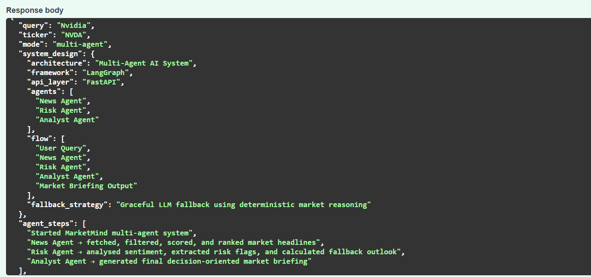
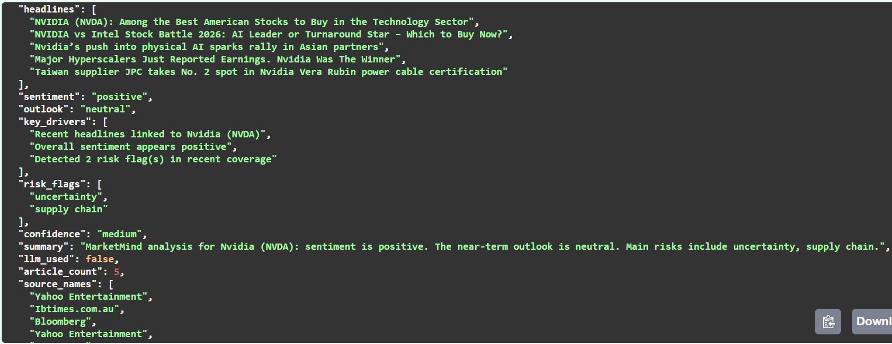
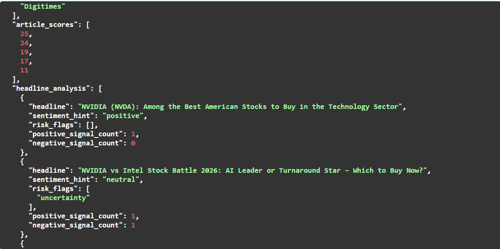
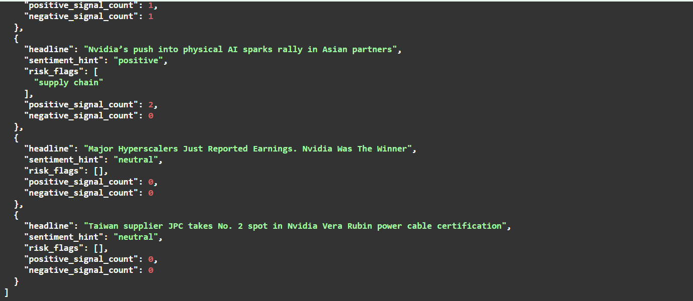
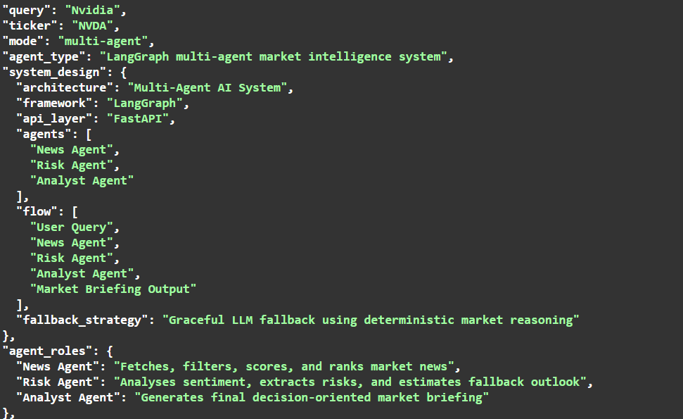
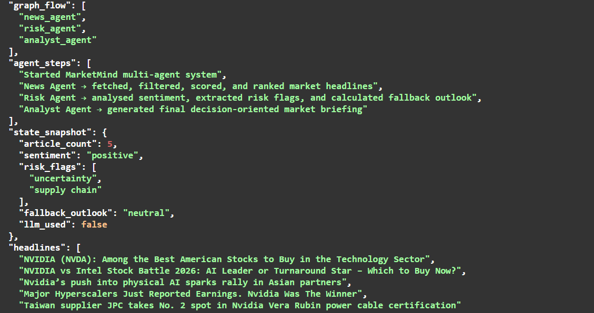
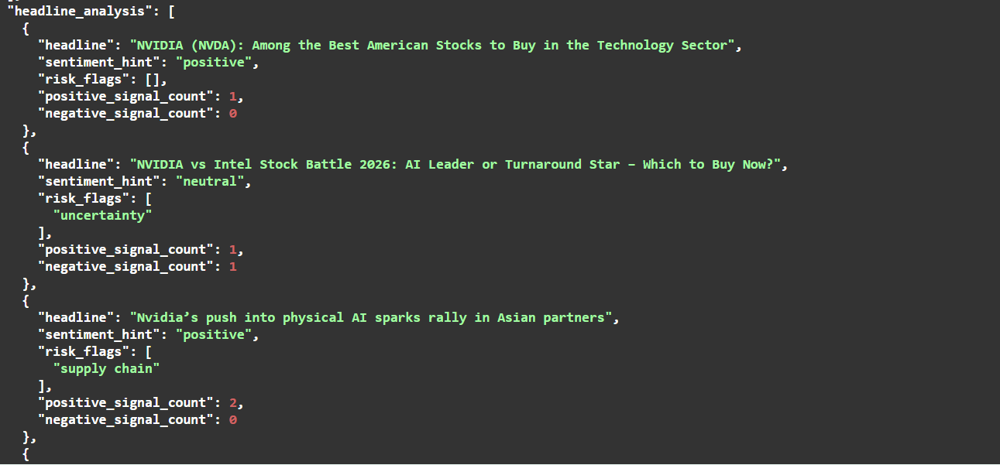
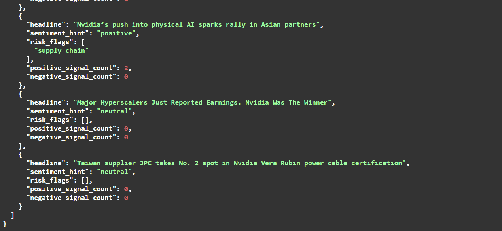

#  MarketMind Agent

A production-style **Multi-Agent AI System** that transforms real-time market news into structured, decision-oriented financial insights.

---

##  Overview

MarketMind Agent is designed to go beyond simple prediction models.

It simulates how real-world AI systems operate by:

- Filtering noisy market data
- Extracting actionable signals
- Coordinating multiple specialised agents
- Producing structured financial insights
- Maintaining reliability even when AI models fail

---

##   Architecture

## System Architecture

## System Architecture

MarketMind Agent follows a modular AI pipeline:

```text
    User Query
        │
        ▼
    News Agent
        │
        ▼
    Risk Agent
        │
        ▼
   Analyst Agent
        │
        ▼
  Market Briefing Output

```
---


### Agents

- **News Agent**
  - Fetches real-time headlines
  - Filters irrelevant content
  - Scores and ranks articles

- **Risk Agent**
  - Performs sentiment analysis
  - Extracts financial risk signals
  - Computes fallback market outlook

- **Analyst Agent**
  - Generates structured market insights
  - Produces outlook (bullish / neutral / cautious)
  - Summarises key drivers and risks

---

##  Tech Stack

- **FastAPI** → API layer  
- **LangGraph** → Agent orchestration  
- **Python (NLP + ML logic)** → sentiment & risk analysis  
- **NewsAPI** → real-time data source  
- **Fallback Logic** → deterministic reasoning when LLM fails  

---

## Key Features

- ✅ Multi-Agent AI Architecture  
- ✅ Stateful agent orchestration (LangGraph)  
- ✅ Real-time market data processing  
- ✅ Risk & sentiment analysis engine  
- ✅ Intelligent news filtering (noise removal)  
- ✅ Graceful LLM fallback (no system failure)  
- ✅ Agent reasoning trace (`/agent/trace`)  
- ✅ System observability (`/agent/health`)  

---

## API Endpoints

### 🔹 Market Briefing
**How It Works**
The user submits a company name and optional ticker.

# POST /briefing

Returns structured financial insights.

---

## API Endpoint
POST /briefing

Generates a structured market briefing for a company.


### 🔹 Agent Trace

# POST /agent/trace

Shows internal agent execution steps and reasoning.

---

### 🔹 System Health

# GET /agent/health

Displays system status and architecture.

---

## Example Output

```json
{
  "mode": "multi-agent",
  "system_design": {
    "architecture": "Multi-Agent AI System",
    "framework": "LangGraph"
  },
  "sentiment": "positive",
  "outlook": "neutral",
  "risk_flags": ["uncertainty", "supply chain"]
}
```

## Resilience Design

If the LLM layer fails (quota, latency, etc.):

- System continues execution
- Falls back to deterministic reasoning
- Still produces meaningful output

This mimics **real production AI systems.**


# Getting Started
**How to Run Locally**
1. Clone the repository
    git clone https://github.com/EduMartinezz/marketmind-agent.git
    cd marketmind-agent

2. Create and activate a virtual environment
Windows
  - python -m venv venv
  - venv\Scripts\activate

3. Install dependencies
  - pip install -r requirements.txt

4. Configure environment variables

  - Create a **.env** file in the project root:

  - NEWS_API_KEY=your_news_api_key
  - OPENAI_API_KEY=your_openai_api_key

5. Run the API
  - uvicorn app.main:app --reload

6. Open Swagger Docs
  - http://127.0.0.1:8000/docs

## Screenshots

### API Documentation


### 🔹 Market Briefing Output








---

### 🔹 Agent Execution Trace








---

### 🔹 System Health


---

## Why I Built This

Most AI projects stop at:

- Single models
- Static pipelines

MarketMind demonstrates:

- Multi-agent collaboration
- Fault-tolerant AI design
- Production-style architecture
- Decision-oriented AI systems
---

## Future Improvements
- Agent memory (short-term + long-term)
- Tool selection via LLM (ReAct-style)
- Multi-agent communication layer
- Real-time streaming updates

## Connect

If you're working on:

AI systems
Agent architectures
Production ML pipelines

Let’s connect.


**Author**

Martin Chinedu Oguejiofor
Applied AI | Data Science | Machine Learning